# This is the readme file for the ICP12

Where this icp is about learning and using firebase in mobile applications and SQLite.

# OUTPUTS

**SQLITE**

1. Intial Screen

   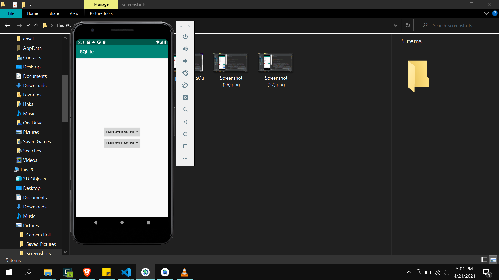

2. Employee Activity

   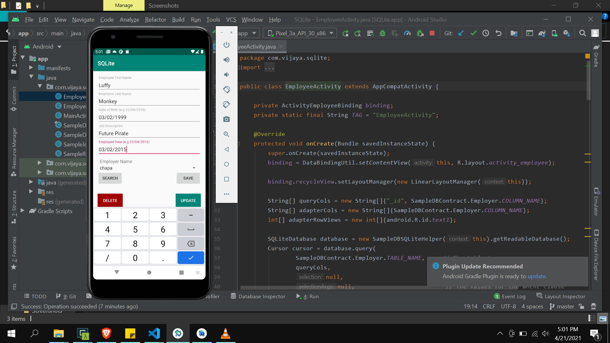

3. Employee Activity Output

   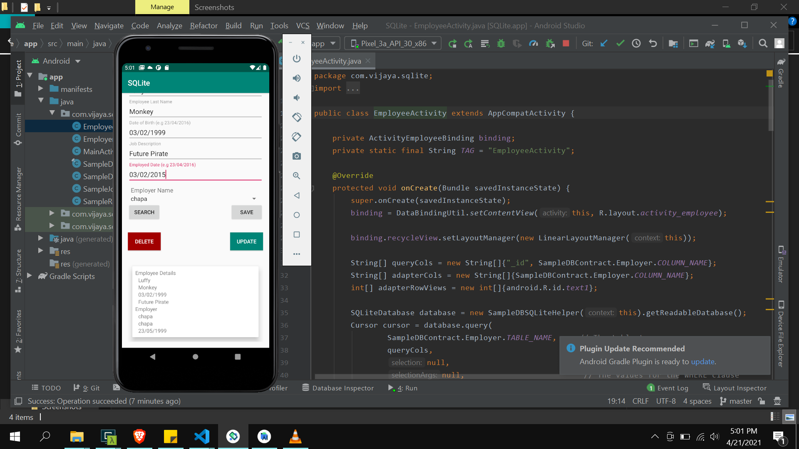

4. Employer Data Added.

   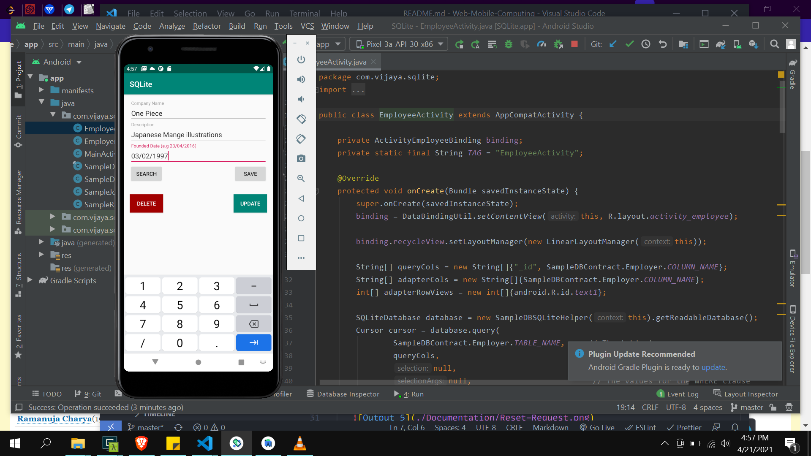

5. Employer Data Output

   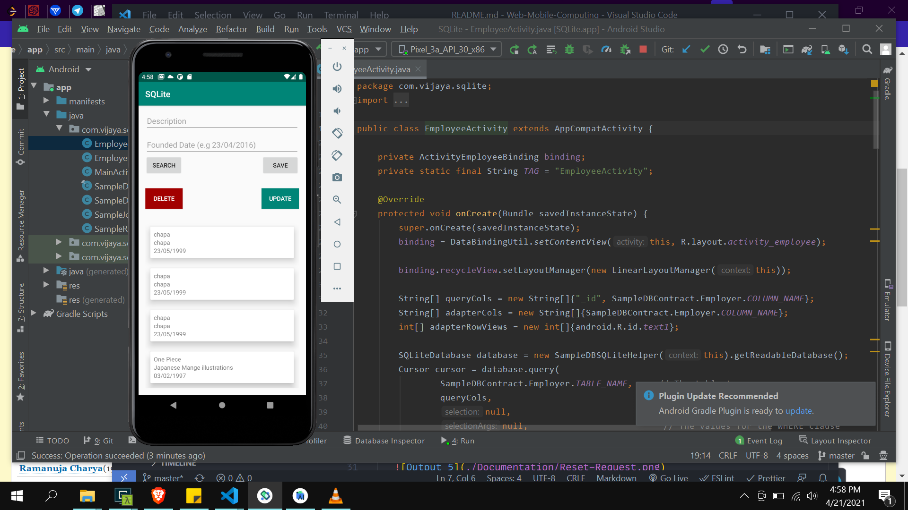

**FIREBASE AUTHENTICATION APPLICATION:**

1. Initial Screen when application is loaded.

   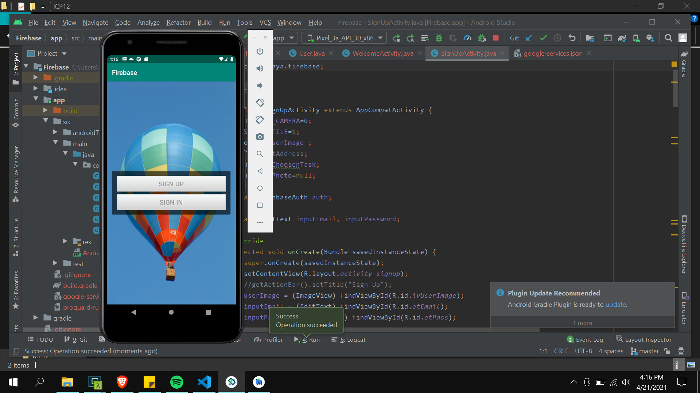

2. Firebase signup screen

   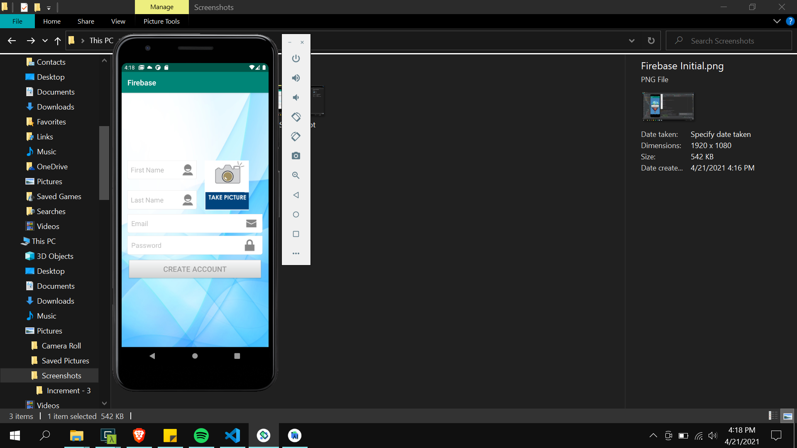

3. Firebase sign in screen

   

4. Firebase Authentication

   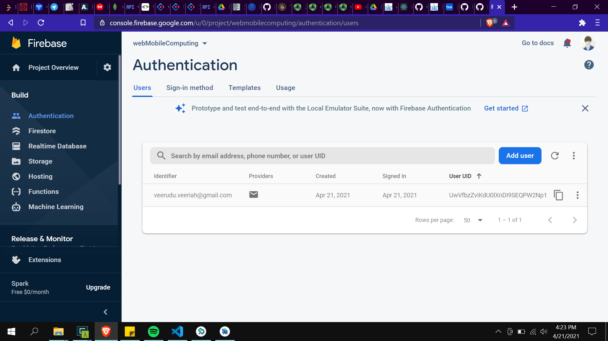

5. Reset Password Request

   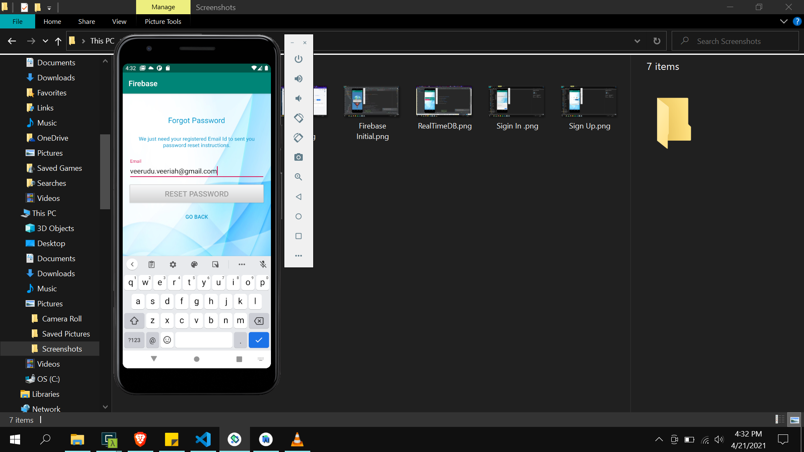

6. Password Reset Link

   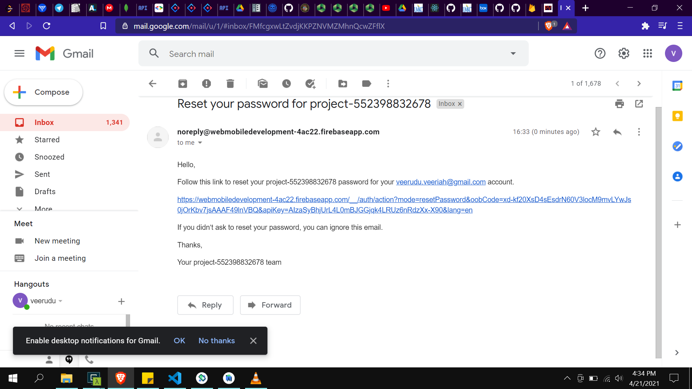

7. Real Time DataBase

   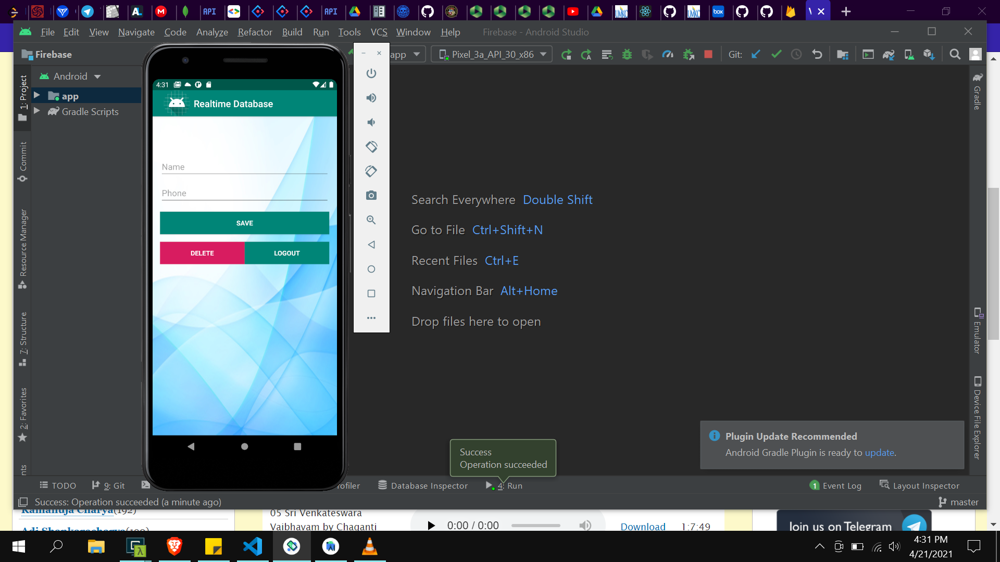

8. Data Added

   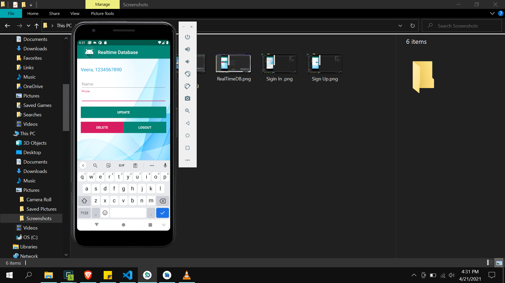
